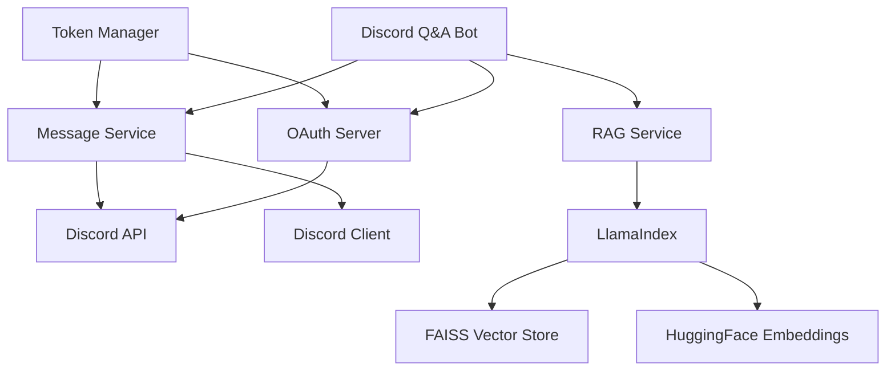

# Discord Q&A Bot with RAG

A powerful Discord bot that uses Retrieval-Augmented Generation (RAG) to provide intelligent answers based on your Discord server's message history.

## Features

- 🔐 OAuth2 Authentication with Discord
- 📚 Message History Retrieval
- 🔍 Semantic Search using RAG
- 🎯 Configurable Similarity Threshold
- 🚀 FastAPI-based OAuth Server
- 💾 Token Management
- 🔄 Async Operations

## Architecture



## Prerequisites

- Python 3.10 or higher
- Poetry for dependency management
- Discord Application with OAuth2 credentials
- HuggingFace account (for embeddings)

## Installation

1. Clone the repository:
```bash
git clone https://github.com/yourusername/discord-qa-bot.git
cd discord-qa-bot
```

2. Install dependencies using Poetry:
```bash
poetry install
```

3. Create a `.env` file in the root directory with your Discord credentials:
```env
DISCORD_CLIENT_ID=your_client_id
DISCORD_CLIENT_SECRET=your_client_secret
DISCORD_REDIRECT_URI=http://localhost:8000/callback
```

## Usage

1. Start the bot:
```bash
poetry run discord-qna-bot
```

2. The bot will:
   - Start the OAuth server
   - Open your browser for Discord authentication
   - Fetch messages from your Discord servers
   - Process messages for RAG
   - Allow you to query the message history

3. Enter your query when prompted, and the bot will return relevant messages based on semantic similarity.

## Project Structure

```
discord-qa-bot/
├── src/
│   ├── api/
│   │   └── discord_client.py      # Discord API client
│   │   └── oauth_server.py       # OAuth server implementation
│   │   └── token_manager.py      # Token management
│   ├── config/
│   │   └── settings.py           # Application settings
│   ├── core/
│   │   └── message_service.py    # Message processing service
│   ├── models/
│   │   └── discord_models.py     # Pydantic models
│   ├── services/
│   │   └── rag_service.py        # RAG implementation
│   └── main.py                   # Application entry point
├── tests/                        # Test files
├── .env                          # Environment variables
├── pyproject.toml               # Poetry configuration
└── README.md                    # This file
```

## Components

### OAuth Server
- Handles Discord authentication
- Manages token exchange and storage
- Provides callback endpoint

### Message Service
- Fetches messages from Discord servers
- Processes messages for RAG
- Manages message querying

### RAG Service
- Creates vector embeddings using HuggingFace
- Stores embeddings in FAISS index
- Performs semantic search

### Token Manager
- Stores and manages OAuth tokens
- Handles token refresh
- Provides token validation

## Configuration

The bot can be configured through environment variables or the `.env` file:

```env
# Discord Configuration
DISCORD_CLIENT_ID=your_client_id
DISCORD_CLIENT_SECRET=your_client_secret
DISCORD_REDIRECT_URI=http://localhost:8000/callback

# Server Configuration
APP_SERVER__HOST=127.0.0.1
APP_SERVER__PORT=8000
```

## Contributing

1. Fork the repository
2. Create a feature branch
3. Commit your changes
4. Push to the branch
5. Create a Pull Request

## License

This project is licensed under the MIT License - see the LICENSE file for details.

## Acknowledgments

- Discord API
- LlamaIndex
- FAISS
- HuggingFace
